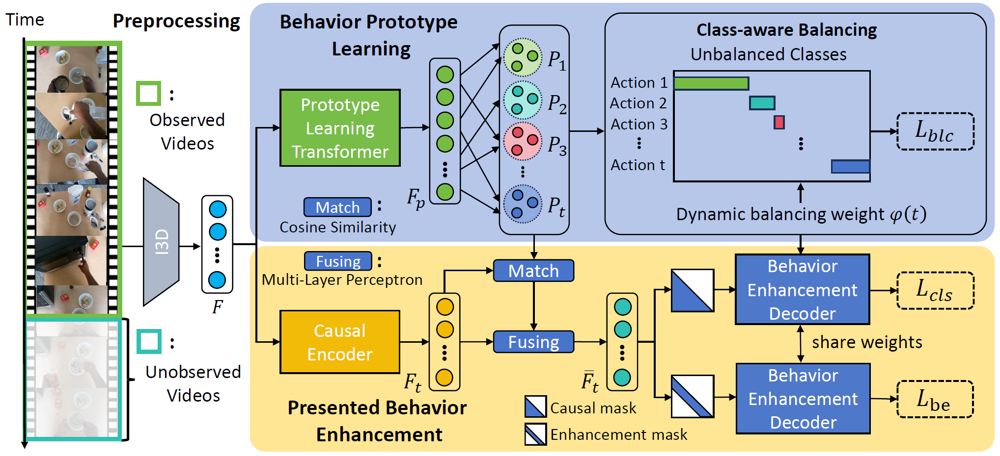
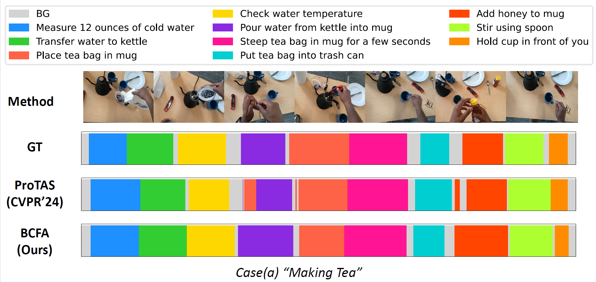
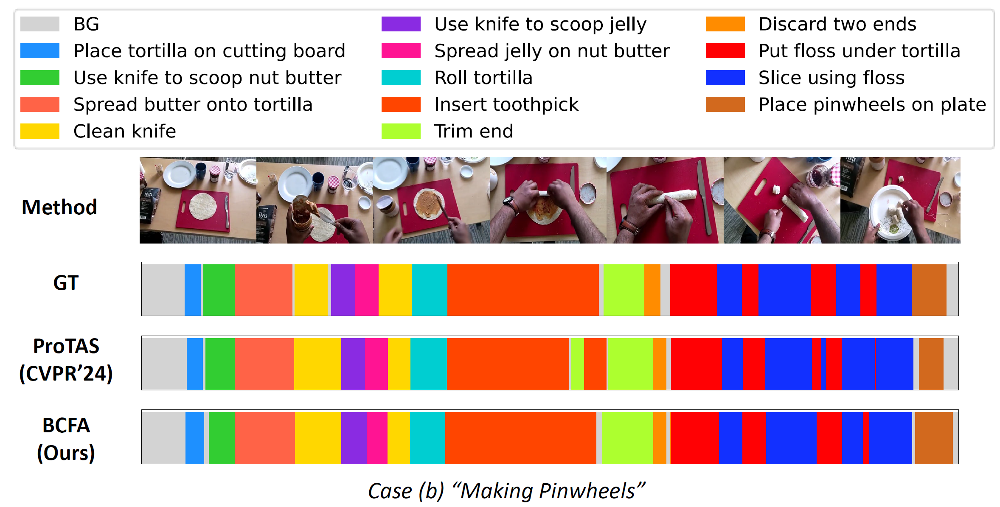

 # Egocentric Online Action Segmentation with Behavior-Centred Feature Augmentation

This is the repository for the paper "Egocentric Online Action Segmentation with Behavior-Centred Feature Augmentation".

The Egocentric Online Action Segmentation (EOAS) task aims to sequentially segment untrimmed egocentric videos into distinct action segments in a streaming manner. 
Previous methods primarily focused on improving contextual information utilization, which highly relied on leveraging the prior context. 
However, under online constraints, the absence of post context limits the effectiveness of the prior context in learning the action semantics. 
Excessive reliance on prior context may lead to insufficient feature representations of current presented behavior. 
<div align="center">
   
   <br><br>
</div>
To tackle this problem, we propose a novel EOAS method, termed Behavior-Centred Feature Augmentation (BCFA) , which consists of two key modules:
(1) Behavior Prototype Learning utilizes prototypes to model the common sense of each action across different surroundings, enhancing the model's ability to capture the shared characteristics of behaviors. 
(2) Presented Behavior Enhancement leveraged both the intrinsic characteristics of the current presented behavior itself and the common sense captured by BPL for feature enhancement, mitigating the absence of post contextualization. 
We evaluate our proposed BCFA method on three public EOAS benchmark datasets, GTEA, EgoProceL, and EgoPER, and demonstrate that our proposed BCFA approach outperforms recent state-of-the-art methods.


## Visualization
<div align="center">
   
   <br><br>
   
   <br><br>
</div>

For more experimental details and visualizations, please refer to our main text and supplementary materials.

## Repository Structure

- **main.py**: Script to train and evaluate the model.
- **BCFA.py**: Contains the implementation of the neural network models.
- **batch_gen.py**: Script for generating batches of data for training and evaluation.
- **eval.py**: Evaluation script.
- **data/**: Directory containing datasets, including ground truth and feature files.

## Data
**GTEA**: download GTEA data from [link1](https://zenodo.org/records/3625992#.Xiv9jGhKhPY) or [link2](https://mega.nz/#!O6wXlSTS!wcEoDT4Ctq5HRq_hV-aWeVF1_JB3cacQBQqOLjCIbc8). Please refer to [ms-tcn](https://github.com/yabufarha/ms-tcn) or [CVPR2024-FACT](https://github.com/ZijiaLewisLu/CVPR2024-FACT).  
**EgoProceL**: download EgoProceL data from [G-Drive](https://drive.google.com/drive/folders/1qYPLb7Flcl0kZWXFghdEpvrrkTF2SBrH). Please refer to [CVPR2024-FACT](https://github.com/ZijiaLewisLu/CVPR2024-FACT).  
**EgoPER**: download EgoPER data from [G-Drive](https://drive.google.com/drive/folders/1xZKJTme1FITMHKB3W_jMutFZV6O3pPDV?usp=sharing). Please refer to [EgoPER](https://www.khoury.northeastern.edu/home/eelhami/egoper.htm) for the original data. 

## Download the checkpoints
We have uploaded the model training checkpoints and the necessary data for testing.  
Please ensure the checkpoint is saved to the directory **models** and the data file is placed in the **data** folder.  

If you download them to other locations, update the corresponding arguments in `main.py` accordingly.


   you can get our checkpoint at [BCFA-checkpoint](https://drive.google.com/drive/folders/1u2_7aE-QfgWdztLoc7tZ9zxjmUFL0FwV?usp=drive_link)
   We will release other files after reviewing.
## Testing
To test the model, use the following command:

```
python main.py --action predict --dataset <dataset_name> --split <split_number> --exp_id BCFA --causal --graph  --balancing_lw <balancing_lw> --be_lw <be_lw> --short_window_scale <short_window_scale>
```

**Note:** Theoretically, to test the model in an online setting, you should use the `--action predict_online` argument, which makes predictions frame by frame. However, if the model is set to be causal, it will only make predictions based on frames up to the current frame. In this case, using `--action predict` will produce the same results while being more efficient.

## Experimental Results on EgoProceL, EgoPER, and GTEA Datasets

### Results on EgoProceL Dataset

|        Method         |  Acc  |  Edit  | F1@0.1 | F1@0.25 | F1@0.5 |
|:---------------------:|:-----:|:------:|:------:|:-------:|:------:|
| MSTCN (CVPR'19)   |  64.5 |  42.5  |  45.2  |   41.6  |  33.0  |
| ASFormer (BMVC'21)|  64.8 |  48.1  |  49.8  |   45.0  |  35.4  |
| OODL (CVPR'22)   |  66.4 |  44.0  |  44.7  |   41.5  |  30.5  |
| ProTAS (CVPR'24)  |  68.5 |  52.1  |  51.6  |   48.6  |  36.8  |
| **BCFA (Ours)**   |  69.1 |  56.9  |  56.3  |   53.0  |  41.0  |

---

### Results on EgoPER Dataset

|        Method       |   Acc   |   Edit   |  F1@0.1  | F1@0.25 |  F1@0.5  |
|:-------------------:|:-------:|:--------:|:--------:|:-------:|:--------:|
| MSTCN (CVPR'19)     |   71.8  |   48.9   |   56.2   |   52.2  |   39.4   |
| ASFormer (BMVC'21)  |   70.3  |   60.6   |   66.1   |   62.3  |   44.7   |
| OODL (CVPR'22)      |   71.2  |   49.3   |   55.6   |   52.3  |   40.0   |
| ProTAS (CVPR'24)    |   71.7  |   62.4   |   68.8   |   65.9  |   48.6   |
| **BCFA (Ours)**     | **76.2**| **72.3** | **73.3** | **70.4**| **58.4** |

---

### Results on GTEA Dataset

|        Method       |   Acc   |   Edit   |  F1@0.1  | F1@0.25 |  F1@0.5  |
|:-------------------:|:-------:|:--------:|:--------:|:-------:|:--------:|
| MSTCN (CVPR'19)     |   74.0  |   64.4   |   71.8   |   69.4  |   56.0   |
| ASFormer (BMVC'21)  |   77.2  |   73.3   |   79.6   |   77.1  |   65.0   |
| OODL (CVPR'22)      |   74.0  |   64.7   |   70.3   |   66.9  |   54.1   |
| ProTAS (CVPR'24)    |   77.0  |   74.1   |   80.2   |   77.5  |   66.1   |
| **BCFA (Ours)**     | **77.3**| **78.6** | **82.6** | **79.4**| **67.6** |


